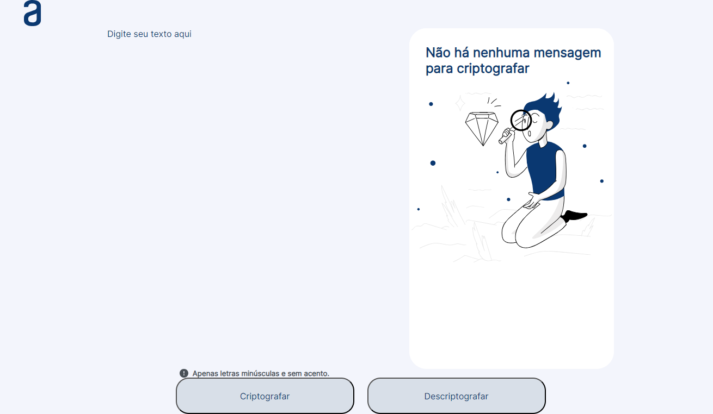

<h1 align="center"> Encriptador de Palavras </h1>

Um encriptador de palavras capaz de encriptar uma mensagem e desencripta-lá para ser entendida.

  <a href="#-tecnologias">Tecnologias</a>&nbsp;&nbsp;&nbsp;|&nbsp;&nbsp;&nbsp;
  <a href="#-projeto">Projeto</a>&nbsp;&nbsp;&nbsp;|&nbsp;&nbsp;&nbsp;
  <a href="#memo-licença">Licença</a>
  &nbsp;&nbsp;&nbsp;|&nbsp;&nbsp;&nbsp;
  <a href="#-certificado"> Certificado</a>

 

## 🚀 Tecnologias

Esse projeto foi desenvolvido com as seguintes tecnologias:

- HTML e CSS
- Git e Github

## 💻 Projeto

Um projeto construido atraves do curso ORACLE + ALURA #ProjetoONE #challengeondedecodificador5. Servindo para encriptar mensagens de texto, aceitando apenas letras minúsculas e sem acento.
[LINK PARA O PROJETO](https://bugred.github.io/desafio-decodificador/)
()

## :heavy_check_mark: Certificado

Certificado adquirido através do curso ONE parceria entre ORACLE e ALURA Acesse o [Certificado](https://d335luupugsy2.cloudfront.net/cms%2Ffiles%2F10224%2F1671211139Prancheta_3.png?utm_campaign=alura_latam_-_challenge_email_projeto_1_br&utm_medium=email&utm_source=RD+Station)

## :memo: Licença

Esse projeto está sob a licença MIT.

---

Feito com ♥ by Yahto Dev :maple_leaf:

